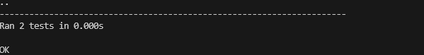
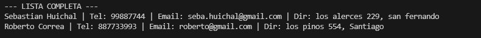
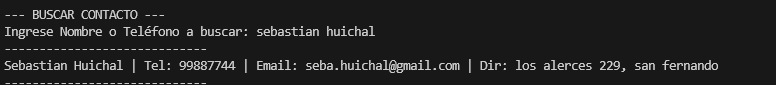
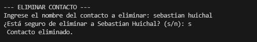

# Informe de Pruebas Unitarias

**Proyecto:** Sistema de Gestión de Contactos
**Alumno:** Sebastián Huichal
**Fecha:** Enero 2026

## 1. Alcance de las Pruebas Automatizadas
Para cumplir con el requisito de pruebas unitarias, se implementó el script `test_agenda.py` utilizando la librería estándar `unittest`.

El objetivo de estas pruebas fue validar la integridad de la estructura de datos principal (Clase `Contacto`), asegurando que la información se almacena y se visualiza correctamente antes de ser manipulada por el menú principal.

## 2. Descripción de los Casos de Prueba

El archivo `test_agenda.py` ejecuta las siguientes verificaciones:

### A. Prueba de Almacenamiento de Datos
**Caso:** `test_datos_contacto`

* **Qué se prueba:** Se verifica que al crear un objeto `Contacto`, los atributos (`nombre`, `telefono`, `email`, `direccion`) se asignen correctamente en memoria.
* **Código ejecutado:**

```python
persona = Contacto("Seba", "12345", "seba@gmail.com", "San Fernando")
self.assertEqual(persona.nombre, "Seba")
# ... (verificación de resto de atributos)
```
### B. Prueba de Formato de Texto
Caso: `test_formato_texto`

 Qué se prueba: Se valida que el método __str__ de la clase genere la cadena de texto con el formato visual específico requerido para listar los contactos.

```python
texto_esperado = "Ana | Tel: 999 | Email: ana@test.com | Dir: Sur"
self.assertEqual(str(persona), texto_esperado)
```
Resultado: ✅ OK. El formato de salida coincide con el diseño esperado.

## 3. Evidencia de Ejecución
Al ejecutar el script mediante el comando python `test_agenda.py`, se obtuvo la siguiente salida exitosa en consola:



## 4. Validación Funcional (Pruebas Manuales)

Dado que las pruebas unitarias cubren la estructura de datos, el flujo lógico del programa (Menú principal, Agregar, Buscar, Eliminar) se validó mediante pruebas funcionales manuales ejecutando `Main.py`.


Agregar y Listar: Se verificó manualmente el ingreso de datos y su aparición en la lista.




Buscar y Eliminar: Se comprobó la interacción del usuario para encontrar y borrar registros.



